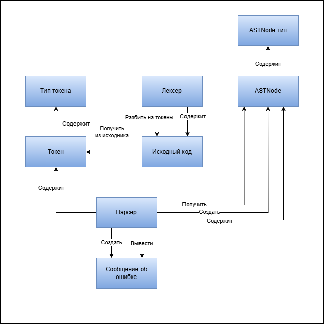
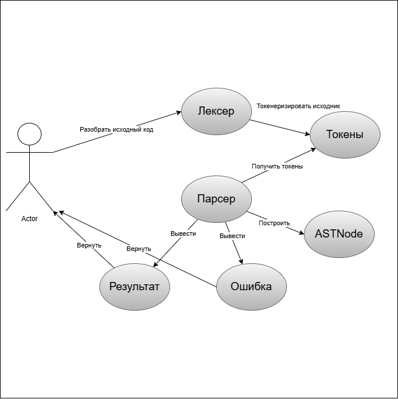
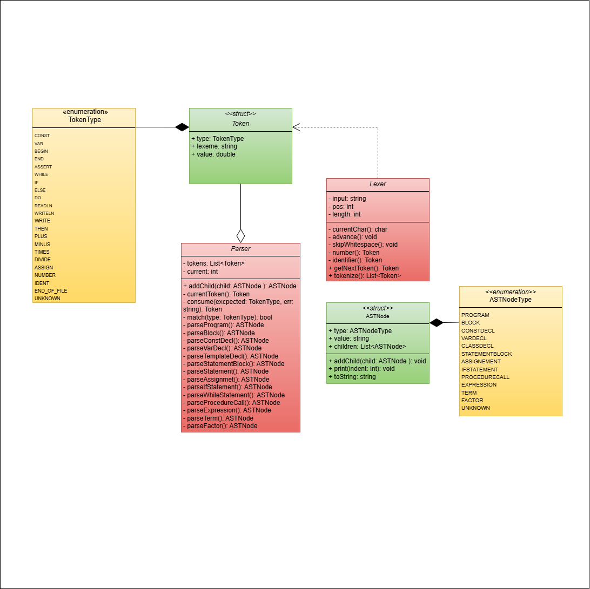

# Синтаксический анализатор Pascal

## 📖 Описание проекта

Полнофункциональный синтаксический анализатор для Pascal-подобного языка, включающий:

- **Лексический анализатор** (разбивает код на токены)
- **Синтаксический анализатор** (строит AST)
- **Поддержка языковых конструкций**:
  - Объявление переменных (`var`) и констант (`const`)
  - Условные операторы (`if-then-else`)
  - Циклы (`while-do`)
  - Ввод/вывод (`readln`, `writeln`)
  - Локальные переменные с инициализацией (`var x := value`)
  - Арифметические и логические выражения

## 📋 Пример работы

### Входные  и выходные  данные
```pascal
const eps = 0.0001;
var a,b: real;
begin
  write('Введите числа a и b (a<b): ');
  readln(a,b);
  assert(a<b);

  var fa := sin(a);
  var fb := sin(b);
  assert(fb*fa<0);

  while (b-a) > eps do
  begin
    var x := (b+a)/2;
    var fx := sin(x);
    if fa*fx <= 0 then
      b := x;
    else
    begin
      a := x;
      fa := fx;
    end;
  end;

  writeln('Корень функции на [a,b] равен ',(b+a)/2);
end.

##Выходные данные
Лексический анализ завершён. Токены:
const eps = 0.0001 ; var a , b : real ; begin write ( Введите числа a и b (a<b):  ) ; readln ( a , b ) ; assert ( a < b
) ; var fa := sin ( a ) ; var fb := sin ( b ) ; assert ( fb * fa < 0 ) ; while ( b - a ) > eps do begin var x := ( b + a
 ) / 2 ; var fx := sin ( x ) ; if fa * fx <= 0 then b := x ; else begin a := x ; fa := fx ; end ; end ; writeln ( Корень
 функции на [a,b] равен  , ( b + a ) / 2 ) ; end .
-----------------------
Дерево разбора:
Program
  Block
    ConstDecl:
      ConstDecl: eps = 0.000100
    VarDecl: a, b : real
    StatementBlock
      ProcedureCall: write
      ProcedureCall: readln
      ProcedureCall: assert
      VarDecl: fa
        Factor: sin
          Factor: a
      VarDecl: fb
        Factor: sin
          Factor: b
      ProcedureCall: assert
      WhileStatement
        Expression: >
          Expression: -
            Factor: b
            Factor: a
          Factor: eps
        StatementBlock
          VarDecl: x
            Term: /
              Expression: +
                Factor: b
                Factor: a
              Factor: 2
          VarDecl: fx
            Factor: sin
              Factor: x
          IfStatement
            Expression: <=
              Term: *
                Factor: fa
                Factor: fx
              Factor: 0
            Assignment: b
              Factor: x
            StatementBlock
              Assignment: a
                Factor: x
              Assignment: fa
                Factor: fx
          Unknown
      Unknown
      ProcedureCall: writeln

Process finished with exit code 0


## 🖼️ Screenshots

<div align="center">
  
  
  
  

</div>

## 🛠️ Technologies
- **Language**: C++20
- **Build System**: CMake
- **Key Components**:
  - `Lexer.h/cpp` - Token generation
  - `Parser.h/cpp` - Syntax analysis
  - `AST.h` - Abstract Syntax Tree
  - `BoundedDeque.h` - Utility container

## 🚀 Getting Started
```bash
git clone https://github.com/BogdanPryadko4853/syntax-analyzer-pascal.git
cd syntax-analyzer-pascal
mkdir build && cd build
cmake .. && cmake --build .
./syntax-analyzer-pascal
