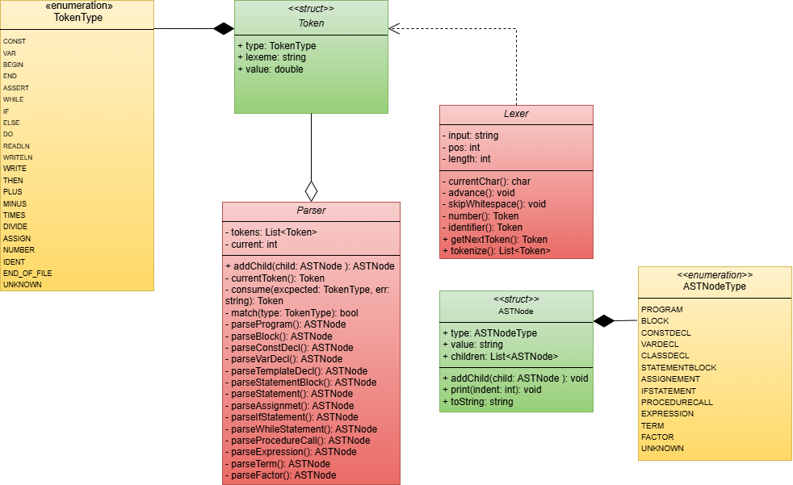
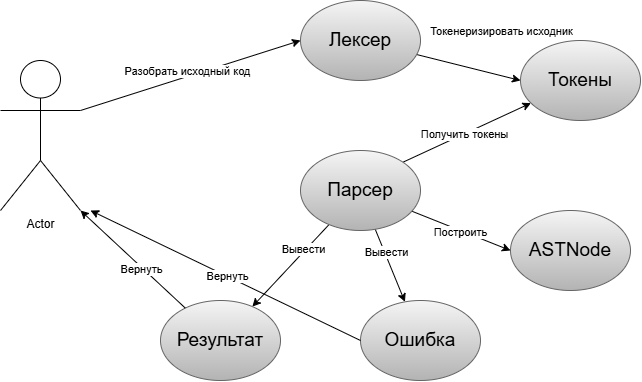

# Syntax Analyzer for Pascal-like Language

## 📖 Project Description


## 🖼️ Screenshots

<div align="center">
  
  
  
  

</div>

## 🛠️ Technologies
- **Language**: C++20
- **Build System**: CMake
- **Key Components**:
  - `Lexer.h/cpp` - Token generation
  - `Parser.h/cpp` - Syntax analysis
  - `AST.h` - Abstract Syntax Tree
  - `BoundedDeque.h` - Utility container

## 🚀 Getting Started
```bash
git clone https://github.com/BogdanPryadko4853/syntax-analyzer-pascal.git
cd syntax-analyzer-pascal
mkdir build && cd build
cmake .. && cmake --build .
./syntax-analyzer-pascal
